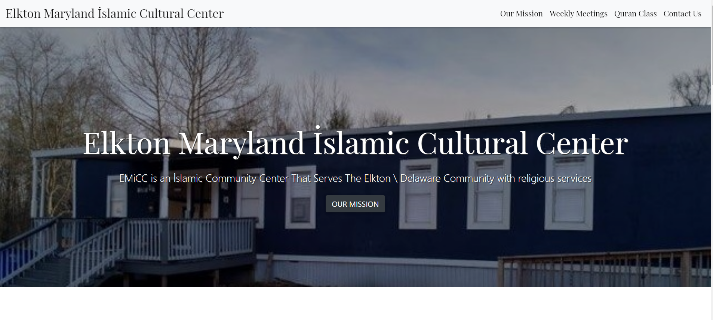
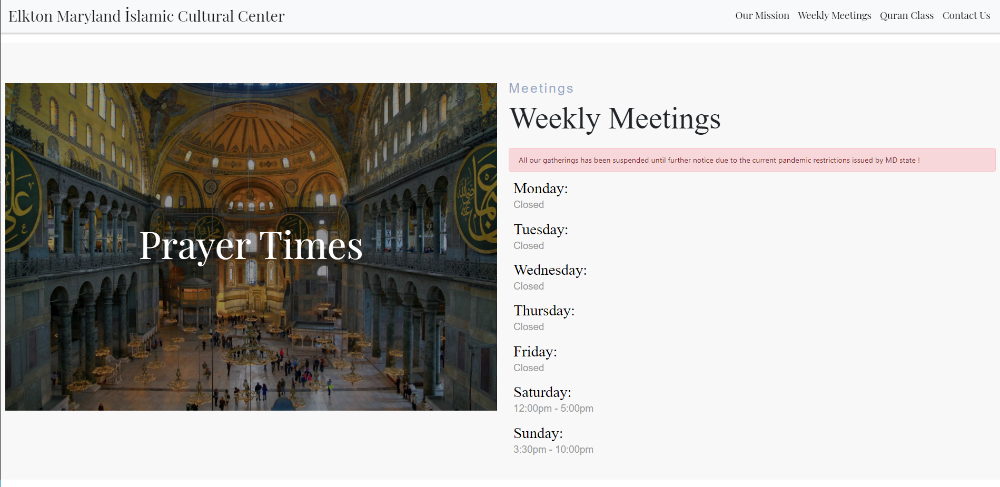

# Webpage for EMiCC

This project is just a front end static web page for Elkton MaryLand Islamic Cultural Center

- #### Local Usage:
  - Git clone the repository.
  - From you terminal, run ```npm install``` to install the dependencies required for the application.
  - Run ``` npm start``` to start the application on the localhost.

## Authors
### Muhammed Ekinci
 -[Github](https://github.com/MuhammedEkinci)
 -[Linkedin](https://www.linkedin.com/in/muhammed-ekinci-/)

## Screenshots





- ### Live usage:
 -deployed link: [Here](https://emicc.herokuapp.com/)
